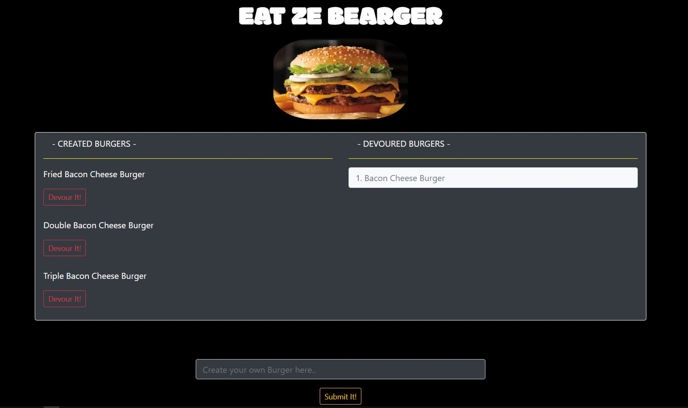

# Burger App
- - - 


### Overview:

In this assignment, we created a burger logger with MySQL, Node, Express, Handlebars and a homemade ORM (yum!). Be sure to follow the MVC design pattern; use Node and MySQL to query and route data in your app, and Handlebars to generate your HTML.

* Eat-Da-Burger! is a restaurant app that lets users input the names of burgers they'd like to eat.

* Whenever a user submits a burger's name, the app will display the burger on the page -- waiting to be devoured.

* Each burger in the waiting area also has a `Devour it!` button. When the user clicks it, the burger will move into the Devoured Burger section.

* Your app will store every burger in a database, whether devoured or not.

- - -
- - -




- - -
- - -
### Directory structure:


```

├── config
│   ├── connection.js
│   └── orm.js
│ 
├── controllers
│   └── burgers_controller.js
│
├── db
│   ├── schema.sql
│   └── seeds.sql
│
├── models
│   └── burger.js
│ 
├── node_modules
│ 
├── package.json
│
├── public
│   └── assets
│       ├── css
│       │   └── burger_style.css
│       └── img
│           └── burger.png
│   
│
├── server.js
│
└── views
    ├── index.handlebars
    └── layouts
        └── main.handlebars
```

- - -

 
- - -

